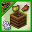
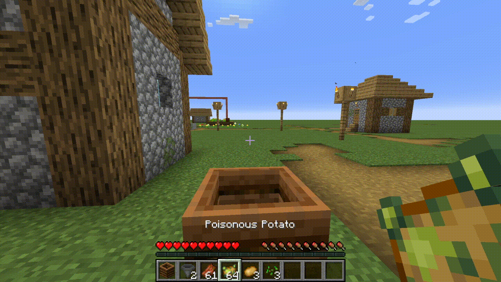

# More Compostable Items

This datapack aims to add composting mechanics to all vanilla items which *should* be compostable, being as close as possible to vanilla mechanics.

## Downloads

- Latest Release (v1): [Github](https://github.com/daenvil/more_compostable_items/releases/download/v1/more_compostable_items_v1.zip) | [PlanetMinecraft](https://www.planetminecraft.com/data-pack/more-compostable-items/)

### Installation
- Drop the datapack zip file inside the "datapacks" folder of your world folder (*\<your minecraft folder\>/saves/\<your world\>/datapacks/*).

## Features

New compostable items, including rotten flesh, poisonous potatoes, foods, and many more (see the list below). These new items are compostable in the following ways:
- By putting them in a hopper on top of a composter, the same way you would do with vanilla-compostable items.
  

  
  

- By dropping them *inside* a composter (vanilla items are also given this feature).
  

  
  

*Note: composting items by dropping them inside composters can be disabled (see ["Available commands" section)](#available-commands)*

You can watch a full showcase of this datapack on [Youtube](https://youtu.be/S8mXr1R7Kl0).

This datapack was tested in a multiplayer server with ~10 players and performed well without any noticeable performance issue.

### List of new compostable items
*(Click to expand)*

10% chance:

- Sugar
- Honeycomb
- Spider eye
- Fermented spider eye
- Phantom membrane
- Scute
- Rabbit hide
- Bamboo
- String
- Feather
- Slimeball
- Magma cream
- Ink Sac (both glow and regular)
- Any dye
- Stick
- Carpets

 
 

30% chance:

- Chorus fruit
- Popped chorus fruit
- Chorus flower
- Honey block
- Honeycomb block
- Rotten flesh
- Egg
- Turtle egg
- Leather
- Dead bush
- Charcoal
- Wool
- Slime block
- Nautilus shell
- Paper
- Cobweb

 
 

50% chance:

- Raw/cooked chicken, cod, mutton, porkchop, rabbit, beef, and salmon
- Rabbit's foot
- Pufferfish
- Tropical fish
- Crimson/warped nylium

 
 

65% chance:

- Poisonous potato
- Corals (dead or alive)
- Bee nest

 
 

85% chance:

- Beetroot soup
- Mushroom/rabbit/suspicious stew
- Coral blocks (dead or alive)

 
 

100% chance:

- Mycelium

*This datapack aims to contain all vanilla items which should be compostable in a realistic way, so if you find any item that is missing or should be changed, please [contact me](#contact).*

### Adding new compostable items

This datapack provides item tags for 10%, 30%, 50%, 65%, 85%, and 100% composting chances. You can find their .json files in *<this datapack>/data/dnv.recyclecraft/tags/items/*. If you want to customize the datapack for your own use, edit those files however you want.

Warning: there is another item tag for vanilla-compostable items, do not edit that one unless you know what you are doing. It is used to detect when a hopper is containing them as to not overlap vanilla-composting with custom-composting, otherwise, both mechanics would function at the same time, breaking the intended effect of this datapack.

### Known issues (and solutions)

- Custom-composting only works with composters that are placed by players. This means that it wont work with world-generated composters, with composters summoned via commands, or with composters placed *before* the datapack was installed. Simply **break a composter and place it again manually to make the datapack register it**.
- The datapack might have trouble detecting a placed composter if you are moving very fast while placing it. This shouldn't be a problem as long as you are not MLG-360-no-scoping composters. If a composter is not working, just break it and place it again while not moving.
- Some things are hardcoded in this datapack, which means that it can interact in unexpected ways with mods that alter vanilla mechanics:
  - Hopper-custom-composting uses the hopper built-in TransferCooldown variable, so it might conflict with any mod or datapack that changes the vanilla behaviour of hopper cooldowns.
  - Since vanilla-compostable items are hardcoded in Minecraft, I had to hardcode them also in this datapack, so it detects when one of them is present in a hopper and avoid composting other items at the same time. This means that any mod that changes which items are compostable with vanilla mechanics might cause unintended behaviours (but nothing game-breaking).

### Available commands

There are some commands that you can optionally use with this datapack:

- "*/function dnv.compost:dropping_toggle*": enables or disables compost-by-dropping (***on*** by default). Disable it if you don't want compostable items that drop inside a composter to be composted.
- "*/function dnv.compost:uninstall*": removes all the entities and scoreboard objectives created by this datapack. Run this function if you want to stop using the datapack to ensure it leaves no trace. All composter markers will be removed, meaning that if you want to use the datapack again after uninstalling it, you will have to manually replace already existing composters in order for the datapack to register them again.
- "*/function dnv.compost:debug_mode*": enables or disables debug mode (***off*** by default). While debug mode is enabled, you will be able to see small armor stands inside the composters which are registered by the datapack, and some messages will display in chat, like warnings whenever a composter is not registered correctly. *This was implemented for myself to test the datapack, you shouldn't need it except if you are messing with the files and testing things by yourself.*

### Recyclecraft

This datapack is part of a series of datapacks created by me called [Recyclecraft](https://www.planetminecraft.com/collection/133777/daenvil-s-recyclecraft-datapacks/). As such, it shares namespace with the other datapacks in the collection, and I encourage using them all together for a better experience.

## Legal terms

You are allowed to:

- Download, use, and edit this datapack[^1] **for personal use**.
- Use this datapack or variations of it in a Minecraft server.
- Create public content that uses this datapack or variations of it (e.g. gameplay videos on online platforms), as long as you **acknowledge me (Daenvil) as the author of this datapack** and provide a link to [this Github repository](https://github.com/daenvil/more_compostable_items) or [this datapack's page on PlanetMinecraft](TBR)

You are not allowed to:

- Publish this datapack or variations of it without explicit permission from me.

[^1]: For all legal purposes, "this datapack" refers to all the files (source code, images, and any other) present in this repository (https://github.com/daenvil/more_compostable_items).

## Contact

Daenvil:
- PlanetMinecraft profile: [daenvil](https://www.planetminecraft.com/member/daenvil/)
- Discord: [Daenvil#9550](https://discordapp.com/users/395951130380730369)
  
## Explanation for datapackers/modders

Composting is hardcoded in vanilla minecraft, meaning that in order to add new compostable items, the datapack needs to mimic vanilla mechanics via other means.

### Interacting with composters by hand

In vanilla, you right-click a composter with a compostable item to compost it. AFAIK this is impossible to emulate with custom-compostable items, since we don't have a way of detecting a right-click in a composter with them.

So to mimic this, we have multiple options:
- Right-click can be detected with food items, since it's the way you eat them. Theoretically, this could be used to detect when you press right-click with a food item in your hand while facing a composter, and use that to compost the item. However this has two short-comings: it's not an universal solution (we would have to find an alternative for non-food items), and would only work when the player is hungry.
- Right-click *can* be detected by using more complex methods like invisible villagers, item frames, etc. However, these methods have their shortcomings and I do not wish to have to use something as complex as that for something so simple and common as composting items.
- Instead of right-clicking, dropping the items *inside* the composter. This can be easily detected and is the method already used by the other custom composting datapacks I found. It's not the same as the vanilla mechanic, but it's probably the best method we have. This was the chosen approach for this datapack, and I decided to also make vanilla-compostable items compostable this way, for consistency.

### Interacting with composters via hoppers

In vanilla, composting can be automated by placing hoppers on top and below the composter. This was the main goal of this datapack and why I didn't want to expend much effort in composting by hand, since using hoppers along composters is probably the most common method of composting items by far. I couldn't find any datapack that emulates this with custom-compostable items, but it is fairly easy to do:

1. Summon an invisible armor stand in all composters, which stores the composter information. I refer to these as "composter markers".
2. Each tick, check which composter markers have an enabled hopper on top pointing to them.
3. Search all slots of the hopper inventory:
 - If vanilla-compostable items are present, ignore the rest of the algorithm, since they will already be composted with vanilla mechanics.
 - If not, search for the first slot with a custom-compostable item, reduce its count by one and call the appropiate composting function.
 - *(In order to check the item tag of the items in the hopper, they are copied to the composter marker's main hand slot, and checked on there)*
4. A custom composting function emulates the composter behaviour, increasing its level if the appropiate random check was succesful, and producing the corresponding aesthetic effects.
5. The bottom hopper will work as usual, extracting bonemeal when the composter is full.

Some extra details need to be taken into account, like hopper cooldown, stopping custom composting when the composter is full, different composting chances for each item, etc.

In principle, this method should emulate perfectly the behaviour of vanilla composters with any item you want to add, the only short-coming it has right now is that vanilla items are still hardcoded, so it is impossible to change their random composting chances or make them non-compostable. They also have to be manually added to an item tag (dnv.recyclecraft:vanilla-compostable) in order to take them into account in the algorithm, so this could create conflicts with any mod which adds new items which are vanilla-compostable and are not added to that item tag. The effect of such conflict is making hoppered composters be able to process vanilla and custom-compostable items at the same time, though, so it doesn't break anything important, it just doubles the composting speed in the specific case where the hopper contains a custom-compostable item and a vanilla-compostable item which is not in the vanilla-compostable tag at the same time.
